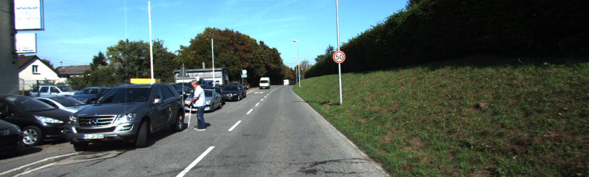
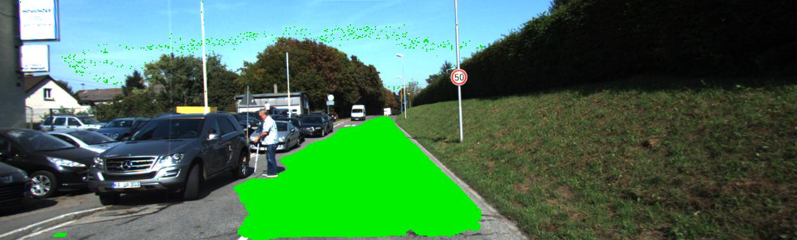
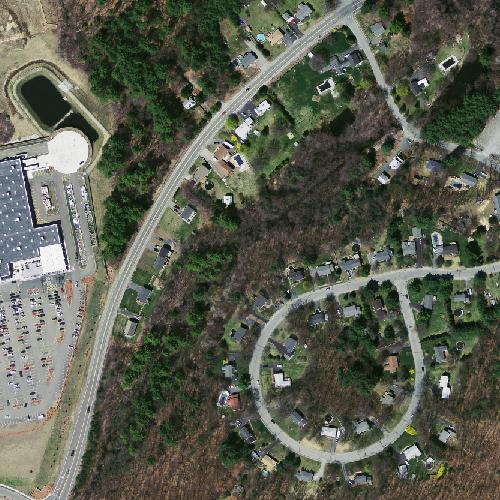
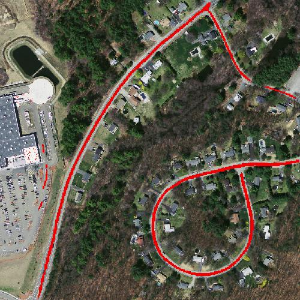

Analyze images
==============

**Segmentation** and **classification** of different types of images.

Classifications
---------------
  - [Digits classification](#digits-classification) using [MNIST dataset](http://yann.lecun.com/exdb/mnist/)
  - [Dogs and cats classification](#dogs-and-cats-classification) using [this dataset](https://www.kaggle.com/c/dogs-vs-cats)

Segmentations
-------------
  - [Roads segmentation](#roads-segmentation) using [KITTI dataset](http://www.cvlibs.net/datasets/kitti/eval_road.php)
  - [Aerial roads segmentation](#aerial-roads-segmentation) using [this dataset](https://www.cs.toronto.edu/~vmnih/data/)
  - [Aerial buildings segmentation](#aerial-buildings-segmentation) using [INRIA aerial images dataset](https://project.inria.fr/aerialimagelabeling/)

Requirements
------------

Before using this repository you must install these programs and libraries:
- [Python 3.6](https://www.python.org/downloads/release/python-360/)
- [Keras](https://keras.io/) >= 2.2.4
- [matplotlib](https://matplotlib.org/) >= 3.0.2
- [numpy](http://www.numpy.org/) >= 1.14.5
- [Pillow](https://pillow.readthedocs.io/en/stable/) >= 6.2.2
- [pydot](https://pypi.org/project/pydot/) >= 2.4.1
- [PyQt5](https://pypi.org/project/PyQt5/) >= 5.11.3
- [scikit-image](https://scikit-image.org/) >= 0.14.2
- [scikit-learn](https://scikit-learn.org/) >= 0.20.2
- [tensorflow](https://www.tensorflow.org/) >= 1.10 (or tensorflow-gpu >= 1.10)

You can download these libraries with the following line:
```
pip install -r requirements.txt
```

Results
-------

### Digits classification

TODO

### Dogs and cats classification

TODO

### Roads segmentation

Before segmentation:



After segmentation:



### Aerial roads segmentation

Before segmentation:



After segmentation:



### Aerial buildings segmentation

Before segmentation:


After segmentation:


